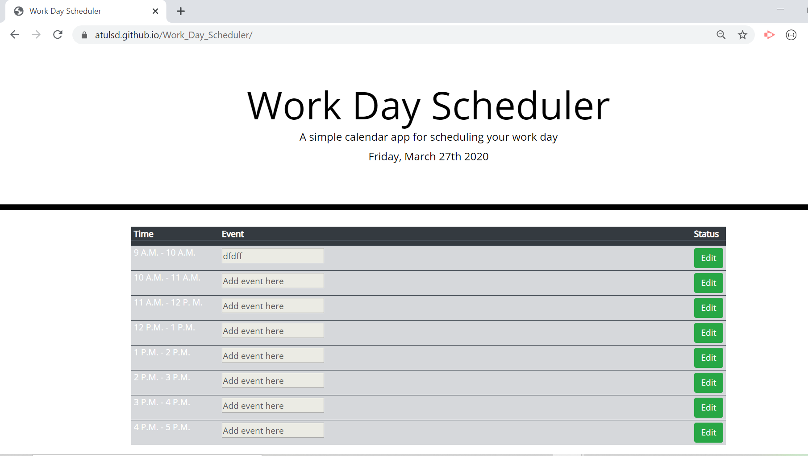

# Portfolio

Project Title: Portfolio

Table of Contents:

[Description](#Description:)

[Steps Taken](#StepsTaken:)

[Installation](#Installation:)

[Usage](#Usage:)

[References](#References:)

[Screenshots](#Screenshots:)

## Description:

This project is about creating Personal Portfolio using Bootstrap for mobile responsiveness. This project includes Github profile, Linkedin profile, resume and project work.

# StepsTaken:

Bootstrap style sheet has been used. As per bootstrap grid layout container, row column strategy has been ued for this project. Media queries and viewport has been used for different screen sizes.

# Installation:

Navigate to following folder
https://github.com/atulsd/updated_portfolio
Clone the Repo

To view the web pages go to the following link
https://atulsd.github.io/updated_portfolio/

# Usage:

This project is about creating Personal Portfolio using Bootstrap for mobile responsiveness.

# Screenshots

# References:

Sticky Footer. https://mdbootstrap.com/docs/jquery/navigation/footer/

Media Queries: https://monash.bootcampcontent.com/monash-coding-bootcamp/mu-mel-fsf-pt-01-2020-u-c/blob/master/2.CSS-Bootstrap/3.Bootstrap_Layouts_and_Responsive_Designs/Slides.pdf

Viewport: https://monash.bootcampcontent.com/monash-coding-bootcamp/mu-mel-fsf-pt-01-2020-u-c/blob/master/2.CSS-Bootstrap/3.Bootstrap_Layouts_and_Responsive_Designs/Slides.pdf

XS, LG, SM Screen size adjustment: https://monash.bootcampcontent.com/monash-coding-bootcamp/mu-mel-fsf-pt-01-2020-u-c/tree/master/2.CSS-Bootstrap/3.Bootstrap_Layouts_and_Responsive_Designs/5.Build_Media_Query

Add screenshots: https://stackoverflow.com/questions/10189356/how-to-add-screenshot-to-readmes-in-github-repository

© 2020 Atul Mahajan. All Rights Reserved.
